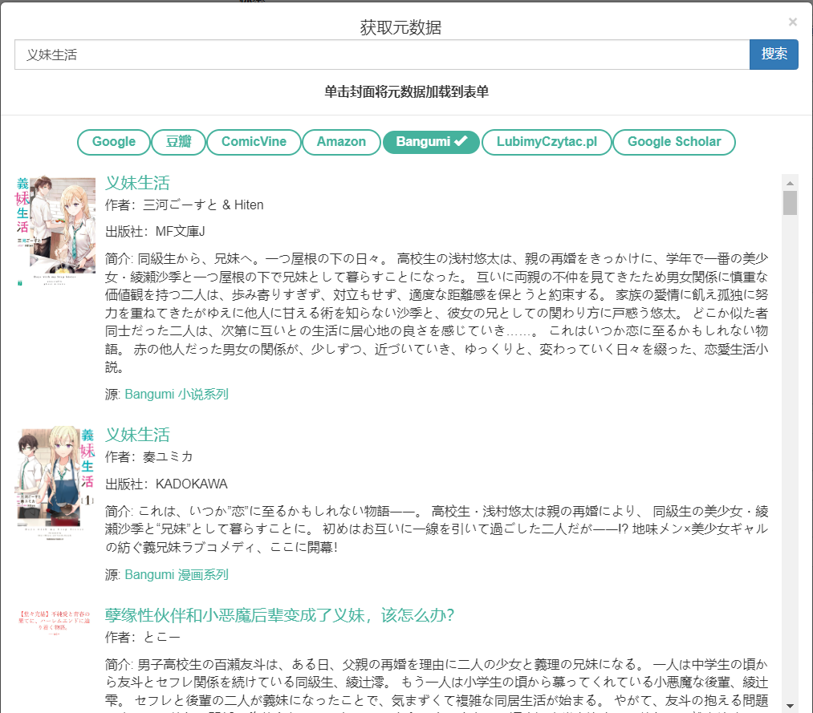
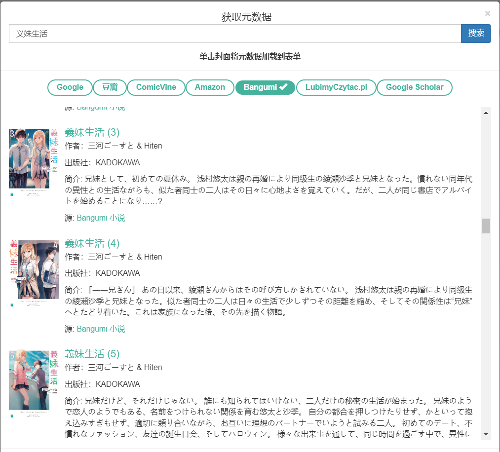

#  Calibre-web Bangumi 元数据插件 🧩

## ✨ Features

* **支持 Bangumi 的元数据检索**
* **支持 NSFW 内容检索**
* **支持漫画 / 小说的主条目检索**
* **支持漫画 / 轻小说的单行本条目检索**
* **目前支持的元数据种类: 标题、简介、作者、发行日期、评分、标签、Bangumi ID、ISBN 书号**

## 📸 Screenshots

**主界面截图**

  

**单行本**

  

## 🏗️ 安装

将 [`bgm.py`](./bgm.py) 复制到 `calibre-web` 项目的 `cps/metadata_provider` 目录下即可。

## 🔨 环境变量

* `BGM_ACCESS_TOKEN`: Bangumi API 访问令牌，用于检索 NSFW 内容。获取令牌方式：https://next.bgm.tv/demo/access-token
* `META_PROVIDER_BGM_THREAD_POOL`: 线程池大小，默认为 8
* `META_PROVIDER_BGM_TAG_LOWEST_USER_CNT`: 对于每个标签的最低用户标记数，低于此值的标签将被过滤，默认为 5
* `META_PROVIDER_BGM_TAG_MAX_CNT`: 每个条目的最大标签数，默认为 10

如果不会设置环境变量可以直接修改 `bgm.py` 中的默认值。

## 🔒️ 许可协议

* 本项目在遵循 [**GNU Affero General Public License v3.0**](https://www.gnu.org/licenses/agpl-3.0.en.html) 许可协议下进行发布 (下简称 AGPL)
* 若对代码进行了修改，请务必遵循许可协议的规定进行发布
* **本项目除 AGPL 外还受以下附加条款限制：本项目暂无合并入 `calibre-web` 主线的计划，并且未经作者同意请勿向 `calibre-web` 提交相关 patch**

## 📌 相关帖子

* https://bgm.tv/group/topic/400540
* https://v2ex.com/t/1051680

## 💡 Future

* **一个 `calibre-web` fork 正在~~火热~~开发中，将全面支持基于 Bangumi 的进度管理和其他额外的炫酷功能（雾**
